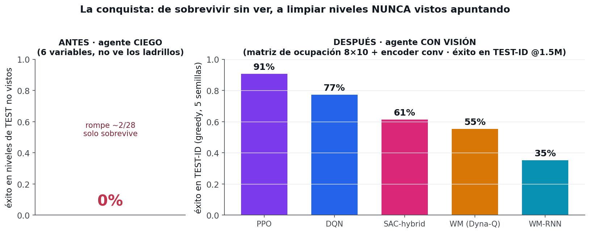
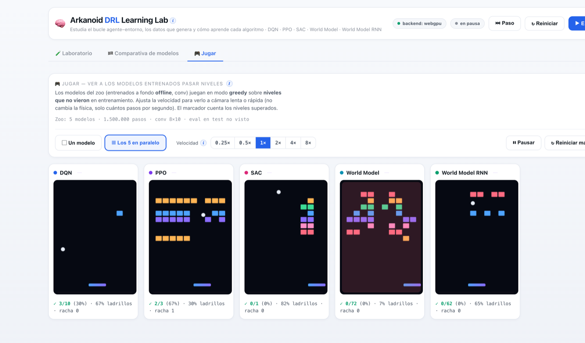
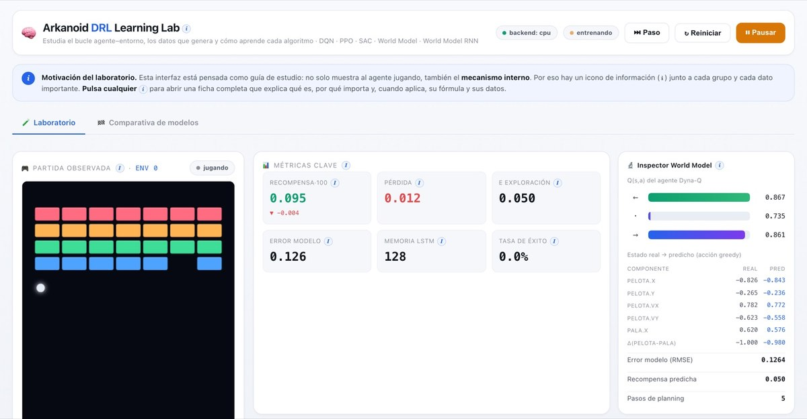
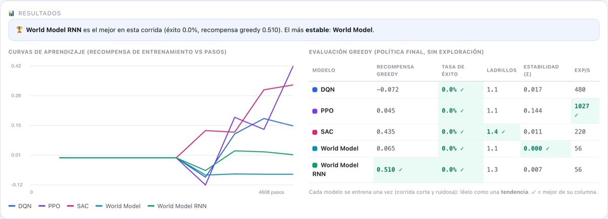

# 🧠 Arkanoid DRL Learning Lab

Un **laboratorio educativo de Deep Reinforcement Learning** donde cinco algoritmos —**DQN, PPO, SAC, World Model y World Model RNN**— aprenden a jugar al Arkanoid **en tu navegador**, con redes neuronales reales sobre **TensorFlow.js** y aceleración **WebGPU** (Metal/MPS en Apple Silicon). El agente no conoce las reglas del juego: las descubre jugando cientos de partidas en paralelo, y tú lo ves aprender en tiempo real.

No es un prototipo visual: el entrenamiento es **real** y está **verificado**. Cada algoritmo entrena con redes neuronales, actualiza sus pesos por descenso de gradiente y mejora de forma medible (recompensa al alza, sin fugas de memoria).

| Tema | Algoritmo | Familia | Qué hace |
|------|-----------|---------|----------|
| 01 | **DQN** — Deep Q-Network | Model-free · valor · off-policy | Aprende Q(s,a) y actúa ε-greedy. Double DQN + Huber + red objetivo. |
| 02 | **PPO** — Proximal Policy Optimization | Model-free · actor-crítico · on-policy | Optimiza la política con objetivo recortado + ventajas (GAE). |
| 03 | **SAC** — Soft Actor-Critic (discreto) | Model-free · actor-crítico · off-policy | Máxima entropía, dos críticos y temperatura α automática. |
| 04 | **World Model** — Dyna-Q | Model-based · off-policy | Aprende un modelo de la dinámica y entrena "imaginando". |
| 05 | **World Model RNN** — Dyna-Q + LSTM | Model-based · recurrente · off-policy | El modelo de la dinámica es un LSTM con memoria que aprende secuencias. |

Además, una pestaña **🏁 Comparativa** entrena los cinco con el mismo presupuesto y los evalúa en modo **greedy** (sin exploración) para compararlos con justicia en un dashboard.

---

## 📄 Cuaderno PDF — descárgalo

Un cuaderno divulgativo de **94 páginas** en castellano que explica, paso a paso y con capturas reales, **los fundamentos del RL** (el bucle agente–entorno, los componentes, las recompensas, los episodios y la red neuronal) y **cómo funciona todo por dentro**: cómo arranca y se ejecuta el juego, cómo el agente toma los controles, cómo se guardan los datos, cómo se entrena la red y cómo se actualizan las gráficas. Cada uno de los cinco algoritmos tiene su capítulo homogéneo —red (con diagramas), **función de pérdida** (qué opciones había y por qué la elegida), justificación de parámetros (con **búsqueda en rejilla**), interpretación de resultados y comparación con el anterior—, y se cierra con una **tabla comparativa global**, una sección de **medición** (por qué la evaluación **greedy** es la forma justa de comparar) y un capítulo de **afinado y conclusiones** con el análisis de convergencia y el ajuste de hiperparámetros validado con datos.

<p align="center">
  <a href="docs/Arkanoid-DRL-Learning-Lab-v2.pdf"></a>
</p>
<p align="center">
  <a href="docs/Arkanoid-DRL-Learning-Lab-v2.pdf"><b>⬇️&nbsp;&nbsp;Descargar el PDF</b></a>
  &nbsp;&nbsp;·&nbsp;&nbsp;94 páginas&nbsp;&nbsp;·&nbsp;&nbsp;~8 MB&nbsp;&nbsp;·&nbsp;&nbsp;español
</p>
<p align="center">
  <a href="docs/Arkanoid-DRL-Learning-Lab-v2.pdf"></a>
</p>

> 💡 En GitHub puedes leerlo online (clic en la portada) o descargarlo desde el visor.

---

## 🏆 El resultado — ahora limpian niveles que nunca vieron

La pregunta no era *«¿el agente sobrevive?»*, sino **«¿se pasa niveles que no ha visto nunca?»**. Con la tarea bien planteada y un **protocolo congelado** (generador de niveles sellado con hash, conjuntos de test disjuntos, **5 semillas** por configuración), varios agentes pasan de **no limpiar nada** a **resolver la mayoría de los niveles de test**.

<p align="center"><br/>
<sub><b>La conquista.</b> Antes (ciego, solo cinemática): 0% en niveles dispersos. Después (visión + encoder convolucional 8×10, TEST-ID @1,5M, media de 5 semillas): PPO 91%, SAC 87%, DQN 77%, World Model 55%, WM-RNN 35%.</sub></p>

**Tabla comparativa** — evaluación *greedy* (sin exploración) en TEST, media de 5 semillas, presupuesto 1,5 M de pasos; en **negrita**, el mejor de cada columna:

| Modelo / variante | TEST-ID | OOD-patrón | OOD-dificultad | Colapsos | Lectura |
|---|:--:|:--:|:--:|:--:|---|
| **PPO** | **91%** | **89%** | **86%** | 0% | El mejor y el más fiable. |
| SAC (actor puro) | 87% | 84% | 68% | 0% | El actor sí funciona. |
| DQN | 77% | 74% | 64% | 0% | Necesita presupuesto; estable. |
| SAC (crítico híbrido) | 61% | 60% | 51% | 20% | Bimodal: a veces colapsa. |
| World Model (Dyna-Q) | 55% | 53% | 42% | 0% | Techo ~55%. |
| World Model RNN | 35% | 29% | 27% | 0% | El LSTM no ayuda aquí. |

> Todas las cifras salen de `results/ledger.csv` (160 runs reales). «Colapsos» = % de semillas por debajo del 10% de éxito. «OOD» = niveles fuera de la distribución de entrenamiento (patrones o dificultades nuevas).

**El hallazgo que importa.** Una ablación (quitar **un** ingrediente cada vez, partiendo de la receta de DQN al 77%) revela que lo que desbloqueó el problema **no fue el algoritmo, sino la formulación**:

- **Ver los ladrillos** con la escala correcta es *el* ingrediente crítico: atenuar esa señal hunde el éxito del 77% al **1%**.
- El **encoder convolucional** (sesgo espacial sobre la rejilla) vale ~20 puntos frente a una lista plana.
- Un **reloj justo** (timeout proporcional al nº de ladrillos, no constante) suma ~23 puntos.
- Sorpresa honesta: **quitar el *reward shaping* mejora** (+8 puntos) — confirmó que esa «ayuda» saboteaba el objetivo real.

> **En una frase:** de 0% (ciego) a **91% en niveles no vistos** (PPO), con 0 colapsos y todas las semillas por encima del 80%. Lo que resolvió el Arkanoid fueron **decisiones de formulación** —qué ve el agente, cuánto tiempo tiene, cómo se mide—, no un algoritmo más sofisticado.

### 🎮 …y ahora puedes verlo jugar

Una tercera pestaña, **Jugar**, pone a los modelos **ya entrenados** (persistidos en `public/modelos/`, generados con `npm run zoo`) a pasar niveles de **test no vistos** en directo, en modo *greedy*. Velocidad ajustable (cámara lenta ↔ rápida), un modelo a pantalla grande o los cinco en paralelo, marcador de niveles superados, y un botón **Regenerar** para reentrenarlos en tu propio navegador.

<p align="center"><br/>
<sub>Los cinco modelos jugando a la vez, cada uno su nivel de test: bajo cada tablero, su tasa de niveles superados (✓ ganadas/partidas) y el % de ladrillos de la partida en curso.</sub></p>

---

## ✨ Características

- **5 algoritmos de RL reales** con redes neuronales (no simulaciones): DQN, PPO, SAC discreto, un World Model (Dyna-Q) y un **World Model recurrente** (Dyna-Q + LSTM).
- **Entrenamiento acelerado por GPU** con TensorFlow.js: detección automática **WebGPU → WebGL → CPU**. ~24.000 experiencias/s en WebGPU.
- **Arquitectura desacoplada**: cientos de entornos *headless* generan los datos; unos pocos *visuales* se dibujan ejecutando la misma política.
- **UI adaptativa**: las métricas, las curvas y el **inspector** cambian según el algoritmo seleccionado.
- **Pestaña Comparativa** (*benchmark*): entrena los cinco con el mismo presupuesto y los evalúa en modo **greedy** (sin exploración) sobre partidas nuevas; dashboard con curvas superpuestas, tabla de métricas y veredicto.
- **Pestaña Jugar** (*model zoo*): modelos pre-entrenados y **persistidos** (`public/modelos/`, vía `npm run zoo`) que juegan **niveles de test no vistos** en greedy; velocidad ajustable (cámara lenta ↔ rápida), uno a pantalla grande o los cinco en paralelo, marcador de niveles, y **re-entrenamiento en el navegador**.
- **Búsqueda de hiperparámetros en vivo** (*grid search*): un pop-up prueba varias combinaciones entrenando un agente aislado por cada una, las ordena por recompensa en tiempo real y permite **aplicar la ganadora** al laboratorio con un clic.
- **Sistema de trazas** estructuradas para monitorización (recompensa, pérdida, exploración, throughput, tensores activos).
- **Sin fugas de memoria**: recuento de tensores constante durante todo el entrenamiento (verificado).
- **Tooltips pedagógicos** extensos en castellano por toda la interfaz.

## 🧩 Requisitos

- **Node.js ≥ 18**
- Un navegador con **WebGPU** (Chrome/Edge/Safari recientes). Si no hay WebGPU, cae a WebGL y, en último caso, a CPU.

## 🚀 Instalación y arranque

```bash
git clone https://github.com/rcanalescoder/DRLArkanoid.git && cd DRLArkanoid
npm install            # vite + @tensorflow/tfjs + backend WebGPU
npm run dev            # abre http://localhost:5173 y pulsa ▶ Entrenar
```

¿Prefieres un solo comando que arranque y, si ya estaba arrancado, **rearranque**?

```bash
./arrancar.sh
```

Verificar que los 5 algoritmos aprenden (sin navegador, backend CPU) o entrenar uno con trazas por consola:

```bash
npm run verificar                                    # entrena los 5 y reporta si aprenden
node scripts/entrenar.mjs dqn --pasos 40000 --envs 128
```

---

## 🖥️ La interfaz

Lo importante arriba (juego, métricas, inspector y curvas, visibles sin scroll); lo pedagógico abajo.

<p align="center"><br/>
<sub>DQN entrenando: partida observada, métricas clave, inspector de Q-values y las cuatro curvas de entrenamiento.</sub></p>

## 🎓 Cómo funciona cada algoritmo

### DQN — Deep Q-Network
Aprende el valor Q(s,a) de cada acción y elige la mayor. Replay buffer, ε-greedy y red objetivo; aquí con Double DQN + pérdida Huber.

<p align="center"><br/><sub>Inspector con los 3 valores Q (greedy en verde), ε decayendo y el buffer llenándose.</sub></p>

### PPO — Proximal Policy Optimization
Optimiza directamente la política (probabilidades de acción) con pasos **recortados** para no desestabilizarse, usando ventajas estimadas con GAE.

<p align="center"><br/><sub>Inspector con π(a|s) como barras de probabilidad, el valor V(s) y la entropía de la política.</sub></p>

### SAC — Soft Actor-Critic (discreto)
Actor-crítico de **máxima entropía**: maximiza recompensa y aleatoriedad, con dos críticos y una temperatura α que **se ajusta sola**.

<p align="center"><br/><sub>La curva de exploración sigue a la temperatura α, que desciende automáticamente.</sub></p>

### World Model — Dyna-Q
**Model-based**: aprende un modelo de la dinámica (s,a)→(s',r) y entrena la política con experiencia **imaginada**.

<p align="center"><br/><sub>Las métricas se adaptan (Error del modelo, Planning) y el inspector compara el estado real con el predicho.</sub></p>

### World Model RNN — Dyna-Q + LSTM
**Model-based recurrente**: el mismo World Model, pero su modelo de la dinámica es un **LSTM** que aprende de **secuencias** y arrastra un estado oculto (memoria), para imaginar trayectorias más coherentes. Inspirado en el MDN-RNN de *World Models* (Ha & Schmidhuber, 2018).

<p align="center"><br/><sub>Las métricas incluyen el tamaño de la memoria LSTM; el inspector compara el estado real con el predicho por el modelo recurrente.</sub></p>

### 🏁 Comparativa de modelos
Una segunda pestaña entrena los cinco con el **mismo presupuesto** y los evalúa en modo **greedy** (sin exploración) sobre partidas nuevas — la forma justa de compararlos, ya que la recompensa de entrenamiento mezcla la exploración de cada uno.

<p align="center"><br/><sub>Curvas de aprendizaje superpuestas, tabla de evaluación greedy (mejor marca por columna) y veredicto automático.</sub></p>

---

## 🔄 Cómo funciona por dentro (resumen)

Una iteración de entrenamiento siempre hace lo mismo (ver el detalle ilustrado en el [cuaderno PDF](docs/Arkanoid-DRL-Learning-Lab-v2.pdf)):

1. **Observar** los estados de los N entornos (un vector de 6 números por partida).
2. La **red decide** las N acciones de una sola pasada por la GPU (inferencia en lote).
3. El **juego avanza** un paso de física fija y devuelve recompensas.
4. Se **guardan** las transiciones `(s, a, r, s', done)` en el replay/rollout buffer.
5. Un **paso de gradiente** acerca la predicción de la red a un objetivo de Bellman (con red objetivo para estabilizar).
6. Se emite una **traza** por el bus de eventos que **refresca las gráficas** en pantalla.

## 🗂️ Estructura del proyecto

```
src/
├── nucleo/            # bus de eventos, constantes, gestor de tensores, trazas
├── entorno/           # entornoArkanoid.js (física) + gestorEntornos.js (pools)
├── agentes/           # ★ las redes y los algoritmos
│   ├── agenteDQN.js  agentePPO.js  agenteSAC.js  agenteWorldModel.js
│   └── redes/constructorRedes.js
├── datos/             # replayBuffer · replayPrioritario (PER) · rolloutBuffer (GAE)
├── entrenamiento/     # ★ orquestador.js (el bucle, sin DOM) + metricas.js
├── ui/                # paneles, curvas e inspectores adaptativos
└── main.js            # arranque + detección de backend
scripts/               # entrenar.mjs · verificarTodo.mjs (verificación en Node)
docs/                  # el cuaderno PDF + capturas
```

## 🛠️ Scripts

| Comando | Qué hace |
|---------|----------|
| `npm run dev` | Arranca el laboratorio en `http://localhost:5173`. |
| `./arrancar.sh` | Arranca y, si ya estaba en marcha, rearranca. |
| `npm run verificar` | Entrena los 5 algoritmos (CPU) y reporta si aprenden. |
| `node scripts/entrenar.mjs <algo>` | Entrena un algoritmo por consola mostrando trazas. |
| `npm run build` | Empaqueta para producción con Vite. |

## 🧠 Arquitectura, en breve

- **Dos pools de entornos**: *headless* (50–2000, generan los datos) y *visual* (8–15, se dibujan con la misma política).
- **Bus de eventos** que desacopla el motor de entrenamiento de la interfaz.
- **Registro de algoritmos** (patrón factoría) e **inspectores intercambiables** por algoritmo.
- **Gestor de tensores** con detección de fugas y actualización suave (Polyak) de las redes objetivo.

---

## 📜 Licencia

Código del laboratorio: **MIT** (ver [LICENSE](LICENSE)). © 2026 Roberto Canales Mora — con Claude Chat / Code · [www.robertocanales.com](https://www.robertocanales.com)
