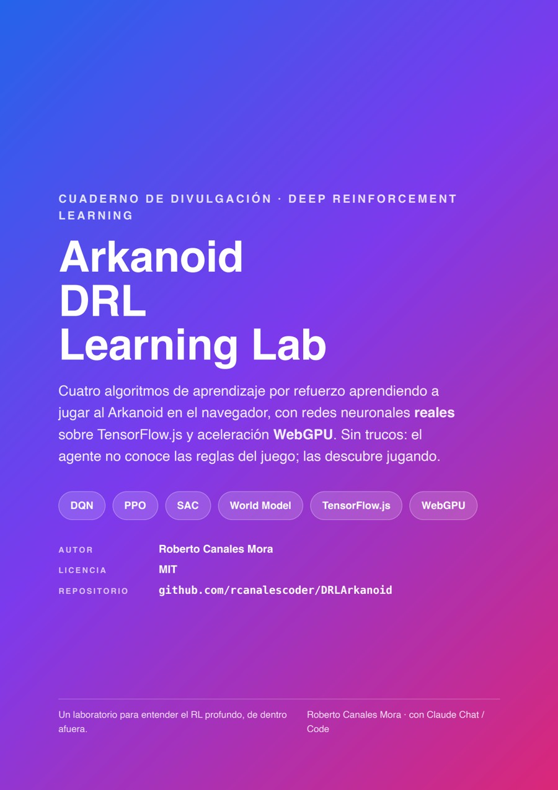
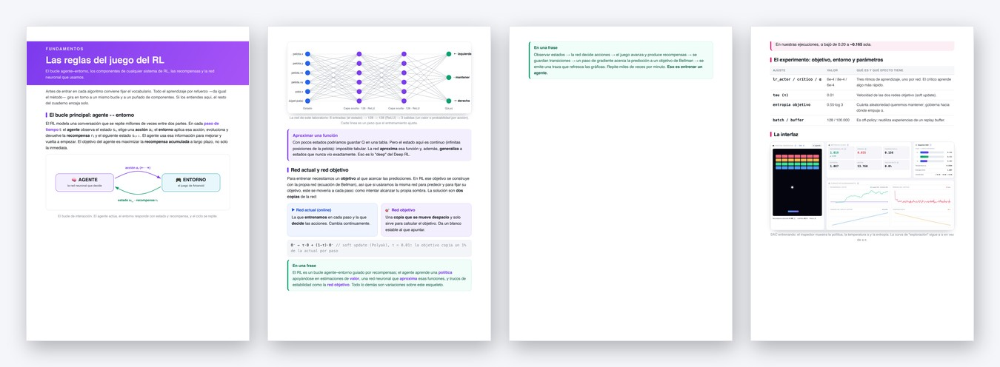
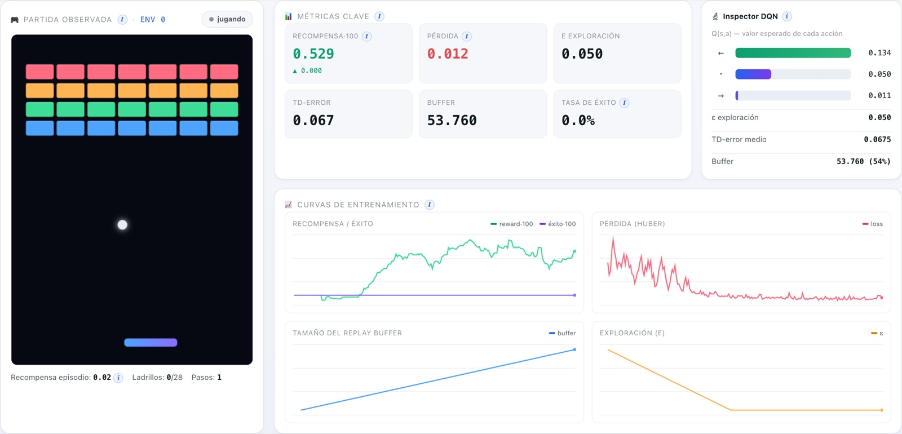
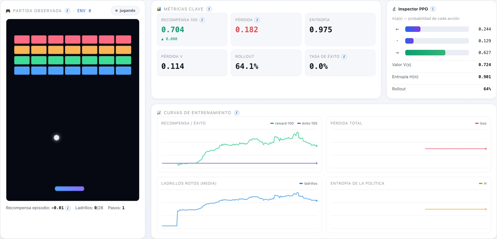
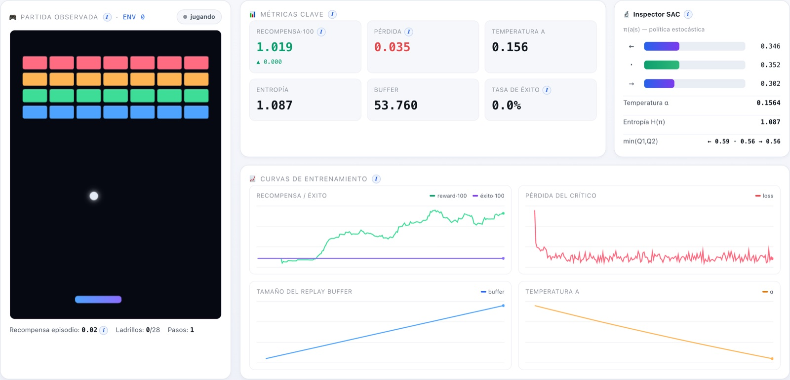
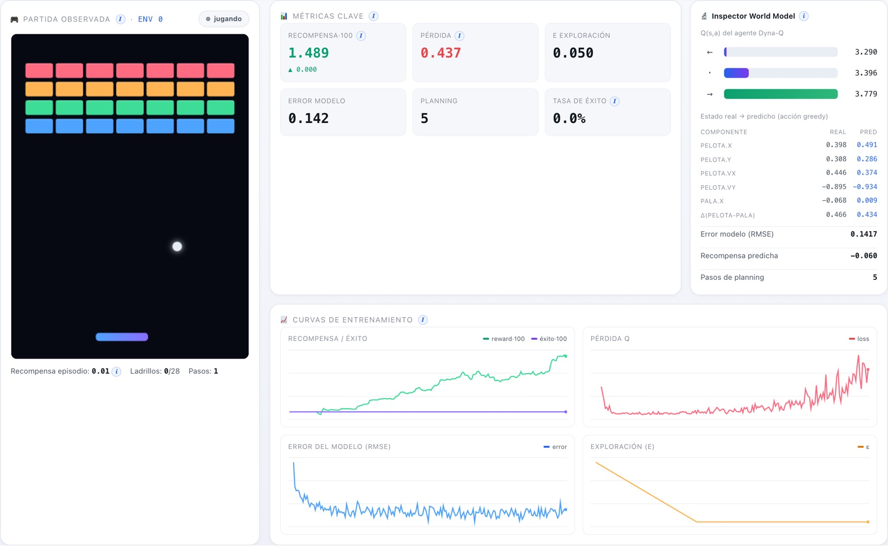

# 🧠 Arkanoid DRL Learning Lab

Un **laboratorio educativo de Deep Reinforcement Learning** donde cuatro algoritmos —**DQN, PPO, SAC y World Model**— aprenden a jugar al Arkanoid **en tu navegador**, con redes neuronales reales sobre **TensorFlow.js** y aceleración **WebGPU** (Metal/MPS en Apple Silicon). El agente no conoce las reglas del juego: las descubre jugando cientos de partidas en paralelo, y tú lo ves aprender en tiempo real.

No es un prototipo visual: el entrenamiento es **real** y está **verificado**. Cada algoritmo entrena con redes neuronales, actualiza sus pesos por descenso de gradiente y mejora de forma medible (recompensa al alza, sin fugas de memoria).

| Tema | Algoritmo | Familia | Qué hace |
|------|-----------|---------|----------|
| 01 | **DQN** — Deep Q-Network | Model-free · valor · off-policy | Aprende Q(s,a) y actúa ε-greedy. Double DQN + Huber + red objetivo. |
| 02 | **PPO** — Proximal Policy Optimization | Model-free · actor-crítico · on-policy | Optimiza la política con objetivo recortado + ventajas (GAE). |
| 03 | **SAC** — Soft Actor-Critic (discreto) | Model-free · actor-crítico · off-policy | Máxima entropía, dos críticos y temperatura α automática. |
| 04 | **World Model** — Dyna-Q | Model-based · off-policy | Aprende un modelo de la dinámica y entrena "imaginando". |

---

## 📄 Cuaderno PDF — descárgalo

Un cuaderno divulgativo de **37 páginas** en castellano que explica, paso a paso y con capturas reales, **los fundamentos del RL** (el bucle agente–entorno, los componentes, las recompensas y la red neuronal) y **cómo funciona todo por dentro**: cómo arranca y se ejecuta el juego, cómo el agente toma los controles, cómo se guardan los datos, cómo se entrena la red y cómo se actualizan las gráficas — además de los cuatro algoritmos uno a uno.

<p align="center">
  <a href="docs/Arkanoid-DRL-Learning-Lab.pdf"></a>
</p>
<p align="center">
  <a href="docs/Arkanoid-DRL-Learning-Lab.pdf"><b>⬇️&nbsp;&nbsp;Descargar el PDF</b></a>
  &nbsp;&nbsp;·&nbsp;&nbsp;37 páginas&nbsp;&nbsp;·&nbsp;&nbsp;~3,8 MB&nbsp;&nbsp;·&nbsp;&nbsp;español
</p>
<p align="center">
  <a href="docs/Arkanoid-DRL-Learning-Lab.pdf"></a>
</p>

> 💡 En GitHub puedes leerlo online (clic en la portada) o descargarlo desde el visor.

---

## ✨ Características

- **4 algoritmos de RL reales** con redes neuronales (no simulaciones): DQN, PPO, SAC discreto y un World Model (Dyna-Q).
- **Entrenamiento acelerado por GPU** con TensorFlow.js: detección automática **WebGPU → WebGL → CPU**. ~24.000 experiencias/s en WebGPU.
- **Arquitectura desacoplada**: cientos de entornos *headless* generan los datos; unos pocos *visuales* se dibujan ejecutando la misma política.
- **UI adaptativa**: las métricas, las curvas y el **inspector** cambian según el algoritmo seleccionado.
- **Sistema de trazas** estructuradas para monitorización (recompensa, pérdida, exploración, throughput, tensores activos).
- **Sin fugas de memoria**: recuento de tensores constante durante todo el entrenamiento (verificado).
- **Tooltips pedagógicos** extensos en castellano por toda la interfaz.

## 🧩 Requisitos

- **Node.js ≥ 18**
- Un navegador con **WebGPU** (Chrome/Edge/Safari recientes). Si no hay WebGPU, cae a WebGL y, en último caso, a CPU.

## 🚀 Instalación y arranque

```bash
git clone https://github.com/rcanalescoder/DRLArkanoid.git && cd DRLArkanoid
npm install            # vite + @tensorflow/tfjs + backend WebGPU
npm run dev            # abre http://localhost:5173 y pulsa ▶ Entrenar
```

¿Prefieres un solo comando que arranque y, si ya estaba arrancado, **rearranque**?

```bash
./arrancar.sh
```

Verificar que los 4 algoritmos aprenden (sin navegador, backend CPU) o entrenar uno con trazas por consola:

```bash
npm run verificar                                    # entrena los 4 y reporta si aprenden
node scripts/entrenar.mjs dqn --pasos 40000 --envs 128
```

---

## 🖥️ La interfaz

Lo importante arriba (juego, métricas, inspector y curvas, visibles sin scroll); lo pedagógico abajo.

<p align="center"><br/>
<sub>DQN entrenando: partida observada, métricas clave, inspector de Q-values y las cuatro curvas de entrenamiento.</sub></p>

## 🎓 Cómo funciona cada algoritmo

### DQN — Deep Q-Network
Aprende el valor Q(s,a) de cada acción y elige la mayor. Replay buffer, ε-greedy y red objetivo; aquí con Double DQN + pérdida Huber.

<p align="center"><br/><sub>Inspector con los 3 valores Q (greedy en verde), ε decayendo y el buffer llenándose.</sub></p>

### PPO — Proximal Policy Optimization
Optimiza directamente la política (probabilidades de acción) con pasos **recortados** para no desestabilizarse, usando ventajas estimadas con GAE.

<p align="center"><br/><sub>Inspector con π(a|s) como barras de probabilidad, el valor V(s) y la entropía de la política.</sub></p>

### SAC — Soft Actor-Critic (discreto)
Actor-crítico de **máxima entropía**: maximiza recompensa y aleatoriedad, con dos críticos y una temperatura α que **se ajusta sola**.

<p align="center"><br/><sub>La curva de exploración sigue a la temperatura α, que desciende automáticamente.</sub></p>

### World Model — Dyna-Q
**Model-based**: aprende un modelo de la dinámica (s,a)→(s',r) y entrena la política con experiencia **imaginada**.

<p align="center"><br/><sub>Las métricas se adaptan (Error del modelo, Planning) y el inspector compara el estado real con el predicho.</sub></p>

---

## 🔄 Cómo funciona por dentro (resumen)

Una iteración de entrenamiento siempre hace lo mismo (ver el detalle ilustrado en el [cuaderno PDF](docs/Arkanoid-DRL-Learning-Lab.pdf)):

1. **Observar** los estados de los N entornos (un vector de 6 números por partida).
2. La **red decide** las N acciones de una sola pasada por la GPU (inferencia en lote).
3. El **juego avanza** un paso de física fija y devuelve recompensas.
4. Se **guardan** las transiciones `(s, a, r, s', done)` en el replay/rollout buffer.
5. Un **paso de gradiente** acerca la predicción de la red a un objetivo de Bellman (con red objetivo para estabilizar).
6. Se emite una **traza** por el bus de eventos que **refresca las gráficas** en pantalla.

## 🗂️ Estructura del proyecto

```
src/
├── nucleo/            # bus de eventos, constantes, gestor de tensores, trazas
├── entorno/           # entornoArkanoid.js (física) + gestorEntornos.js (pools)
├── agentes/           # ★ las redes y los algoritmos
│   ├── agenteDQN.js  agentePPO.js  agenteSAC.js  agenteWorldModel.js
│   └── redes/constructorRedes.js
├── datos/             # replayBuffer · replayPrioritario (PER) · rolloutBuffer (GAE)
├── entrenamiento/     # ★ orquestador.js (el bucle, sin DOM) + metricas.js
├── ui/                # paneles, curvas e inspectores adaptativos
└── main.js            # arranque + detección de backend
scripts/               # entrenar.mjs · verificarTodo.mjs (verificación en Node)
docs/                  # el cuaderno PDF + capturas
```

## 🛠️ Scripts

| Comando | Qué hace |
|---------|----------|
| `npm run dev` | Arranca el laboratorio en `http://localhost:5173`. |
| `./arrancar.sh` | Arranca y, si ya estaba en marcha, rearranca. |
| `npm run verificar` | Entrena los 4 algoritmos (CPU) y reporta si aprenden. |
| `node scripts/entrenar.mjs <algo>` | Entrena un algoritmo por consola mostrando trazas. |
| `npm run build` | Empaqueta para producción con Vite. |

## 🧠 Arquitectura, en breve

- **Dos pools de entornos**: *headless* (50–2000, generan los datos) y *visual* (8–15, se dibujan con la misma política).
- **Bus de eventos** que desacopla el motor de entrenamiento de la interfaz.
- **Registro de algoritmos** (patrón factoría) e **inspectores intercambiables** por algoritmo.
- **Gestor de tensores** con detección de fugas y actualización suave (Polyak) de las redes objetivo.

---

## 📜 Licencia

Código del laboratorio: **MIT** (ver [LICENSE](LICENSE)). © 2026 Roberto Canales Mora — con Claude Chat / Code.
